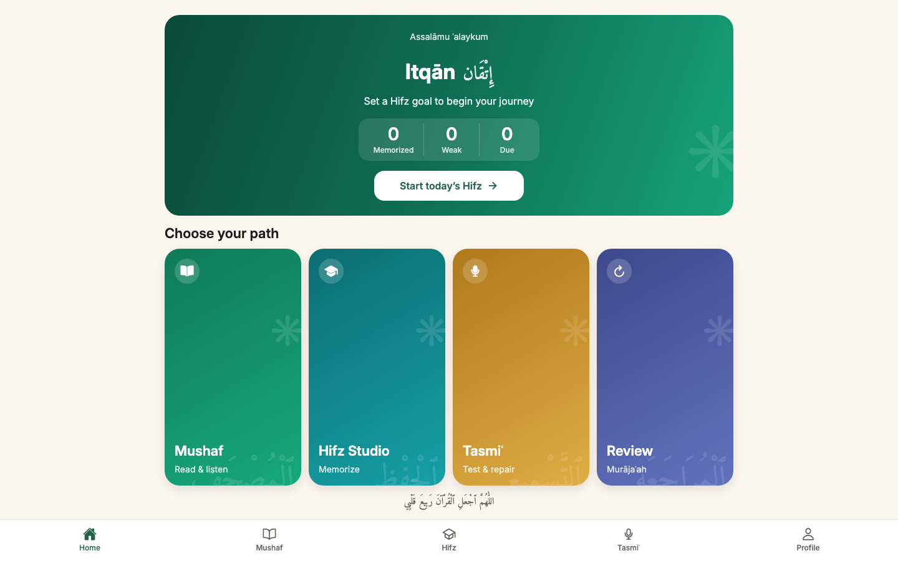
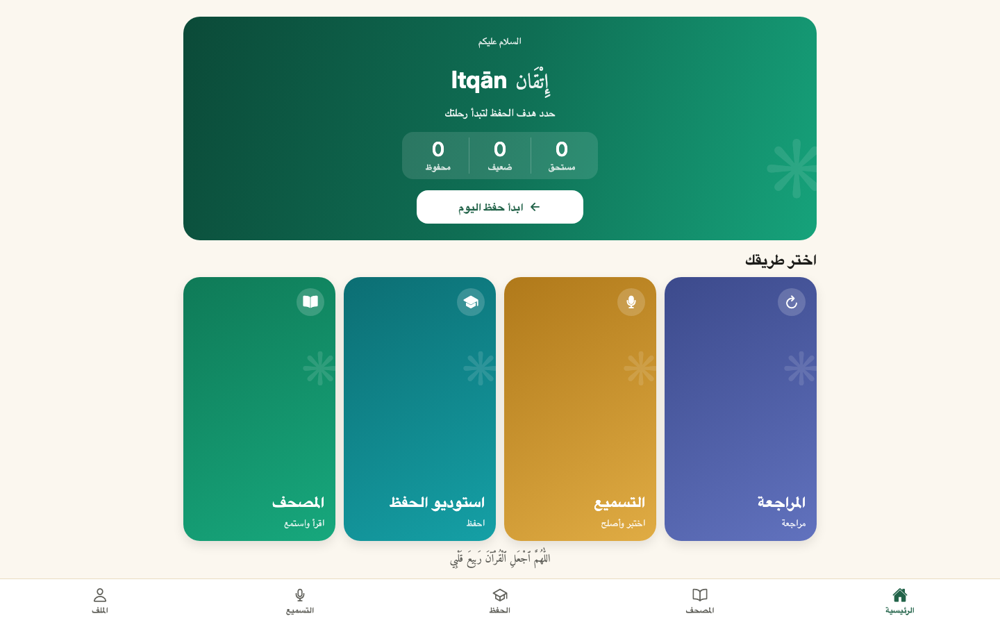
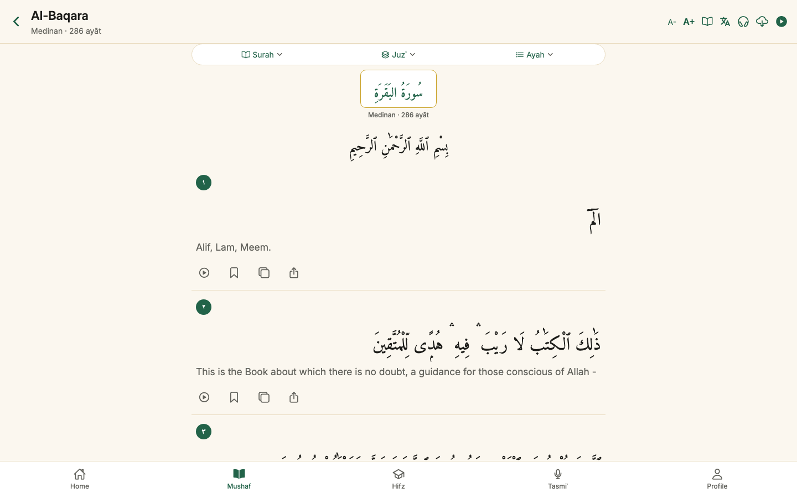
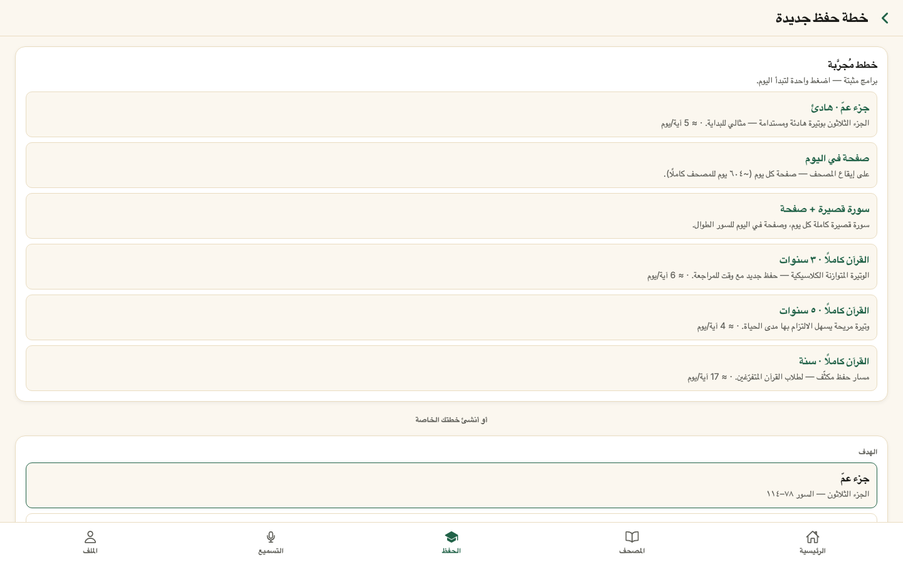
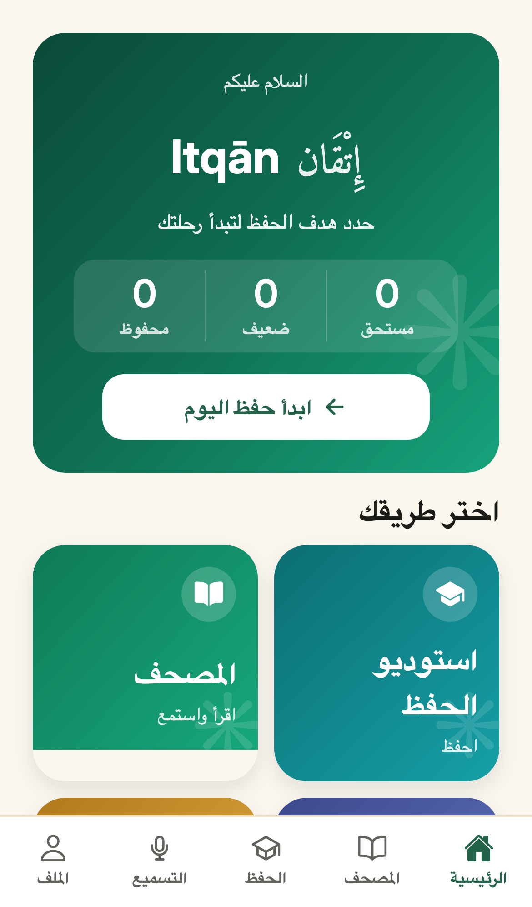
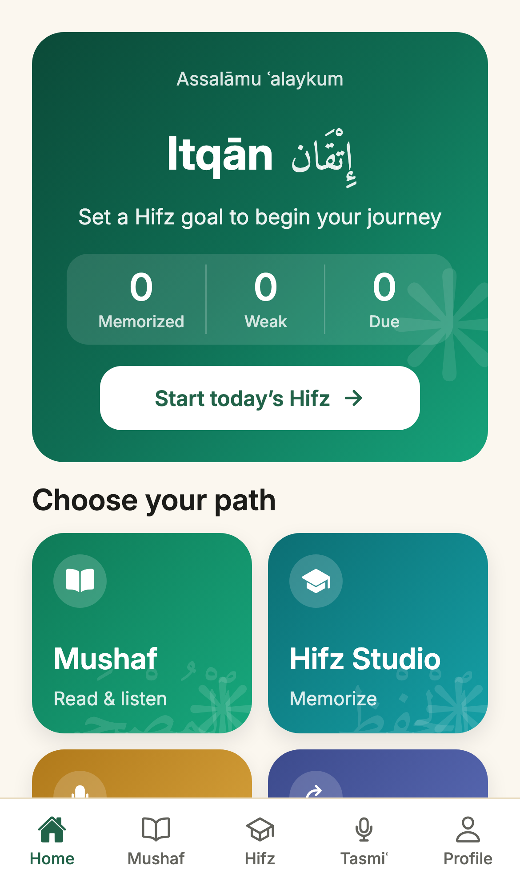
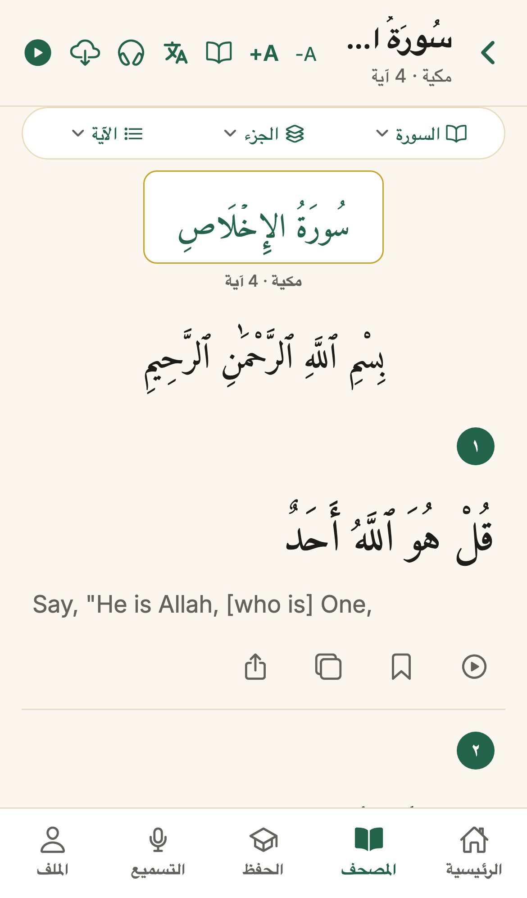
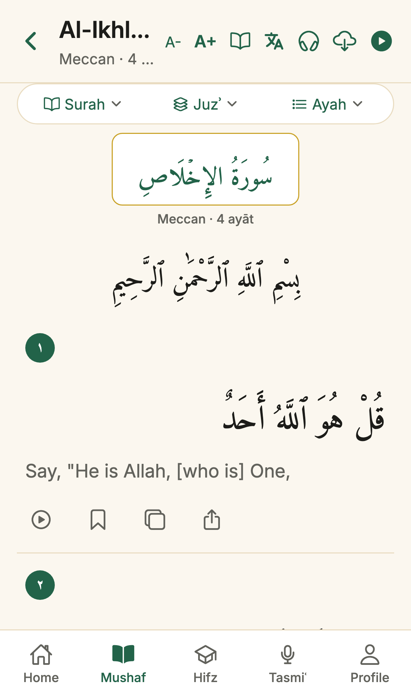

# Itqān — The Hafiz OS

> _Itqān (إتقان): mastery, precision, excellence._

An open-source, **offline-first, AI-assisted Quran memorization** companion. Itqān
is not built around _completion_ — it is built around **retention**: memorizing new
passages, preserving old ones, catching mistakes, repairing weak spots, and doing
it all with adab and without ads, tracking, or noise.

The product is the **memory system**: the Mushaf is the body, the review engine is
the brain, the on-device AI is only the ear, and repair mode is the heart.

- **Runs fully in the browser today** (and shares 100% of its code with a future
  native iOS/Android build).
- **Works offline** — Quran text, fonts, and the database engine are all bundled
  and served from the app's own origin; nothing phones home.
- **Private by design** — your selections and progress live on your device. No
  account required.
- **Localized** in Arabic, English, Urdu, and Persian (RTL + LTR).

**Quickest start:** double-click [`start.command`](start.command) (macOS) or run
`./start.command` — it sets everything up and opens http://localhost:8081. See
[Run it for the first time](#run-it-for-the-first-time).

---

## Features

### 📖 Read — the Mushaf
- **Two reading modes**: ayah-by-ayah cards, or a continuous **printed-Mushaf page**
  laid out like a real muṣḥaf — warm parchment, a double gold rule with corner
  rosettes, an illuminated surah **cartouche**, the basmala, and gilded **ayah-end
  medallions** (۝).
- **Translation** (Saheeh International) with a toggle, **font scaling**, and
  **light / dark / system** themes.
- **Search** — diacritic-insensitive Arabic + translation.
- **Bookmarks**, **continue-reading** (jump back to your last ayah), copy & share.

### 🧠 Memorize — Hifz Studio
- **One unified plan picker**: proven presets (Juzʾ ʿAmma, a page a day, whole-Qurʾān
  in 1/3/5 years, …) and custom goals — a **juzʾ**, a **surah** (with an optional
  **ayah sub-range**), a **range of surahs**, or the **full Qurʾān** — chunked into
  daily assignments by ayah / page / mixed pacing.
- **Memorization session**: progressive **reveal** (full text → first-word hint →
  hidden), **listen with N repeats**, **repeat a selected ayah range**, and
  three-level self-marking (**weak / good / strong**).

### 🔁 Review — Murājaʿah (the hard part of hifz)
- A daily **active-recall** review queue built from a **spaced-repetition** engine:
  each ayah carries a 0–100 strength score that drives its next-review interval.
- Due ayāt are split into the classical **sabaq / sabqi / manzil** tracks (new /
  recent / long-term), surfaced right on the Hifz tab.
- Recall is hidden-first (recite from memory → reveal → grade), and the grade
  reschedules the ayah automatically. Surah / page / juzʾ **strength aggregates**
  give a living map of what's solid and what's slipping.

### 🎙️ Tasmiʿ — recite & get feedback
- Recite a passage from memory and get a **gentle, teacher-style diagnosis** — a
  score, per-word highlighting (different / missed), and notes (missed word, extra
  word, wrong word, repeated word, skipped ayah, …), then a **repair mode** that
  loops your weak ayāt with a recite-back gap.
- **On-device AI recognizer**: recitation is transcribed by **OpenAI Whisper running
  fully in your browser** (WebAssembly via Transformers.js) — **audio never leaves
  your device**. The model downloads once (~tens of MB) and then works offline.
  Falls back to the browser's live recognizer where Whisper isn't available.

### 🔊 Audio & reciters
- Per-ayah streaming with **repeat (one / range)**, **variable speed**, a
  **listen-and-repeat gap** (silent pause after each ayah to recite back),
  **background audio**, and **offline caching** (browser Cache Storage on web,
  per-surah downloads on native).
- Multiple reciters, plus support for **full-surah reciters** for qurrāʾ who aren't
  available ayah-by-ayah. See [Recitation audio](#3-recitation-audio).

### ✨ Across the app
- **Offline-first** local SQLite (sql.js on web, expo-sqlite on native).
- **Ornamental Islamic design system** — calm emerald, parchment, restrained gold,
  geometric rosettes; memory-state colors mirror the Mushaf underline system.
- **Privacy & storage** — selections persist locally via `localStorage` + a
  long-lived first-party cookie; an in-app **Privacy & storage** page (Profile →
  Privacy) explains exactly what's stored and lets you wipe it.
- **Optional** Supabase backend for auth / profiles / cross-device sync (the app is
  fully functional without it).

---

## Screenshots

> One React Native codebase, running on the web today and on iOS/Android via the
> same screens. Fully localized.

### Home
| English | العربية |
| ------- | ------- |
|  |  |

### Mushaf reader · Hifz planner
| Reader (EN) | Plan (AR) |
| ----------- | --------- |
|  |  |

### On a phone
| Home (ع) | Home (EN) | Reader (ع) | Reader (EN) |
| -------- | --------- | ---------- | ----------- |
|  |  |  |  |

---

## Run it for the first time

### One click

**Double-click [`start.command`](start.command)** (macOS) or run it from a terminal:

```bash
./start.command            # or: pnpm start
./start.command --backend  # also start the local Supabase stack (needs Docker)
./start.command --no-open  # don't auto-open the browser
```

It's **idempotent**: it installs dependencies, vendors the sql.js engine,
downloads the fonts, and generates the Quran data **only when those assets are
missing** — nothing is re-fetched if it's already there — then opens the web app at
**http://localhost:8081**.

> **Prerequisites:** Node 20+ (22 recommended) and pnpm (the script enables it via
> Corepack if needed). Docker only if you want the optional local backend.

### What gets set up (and where it comes from)

A fresh checkout is **code only** — the heavy runtime assets are not committed. The
first run fetches or generates each one; later runs skip anything already present.
To do it by hand (CI, offline mirror, debugging), run these **in order** from the
repo root:

**1 · App dependencies** — `pnpm install` _(npm registry, ~hundreds of MB)_

**2 · Web SQLite engine** — copies `sql.js` (WebAssembly) into the app's origin
```bash
pnpm --filter @itqan/mobile sync:sql-wasm
# → apps/mobile/public/sql-wasm.js + sql-wasm.wasm   (~690 KB, web only)
```

**3 · Fonts** — Amiri Quran (Arabic/Uthmani) + Inter (UI), from Google Fonts
```bash
curl -sSL -o apps/mobile/assets/fonts/AmiriQuran-Regular.ttf \
  "https://github.com/google/fonts/raw/main/ofl/amiriquran/AmiriQuran-Regular.ttf"
curl -sSL -o apps/mobile/assets/fonts/Inter.ttf \
  "https://github.com/google/fonts/raw/main/ofl/inter/Inter%5Bopsz%2Cwght%5D.ttf"
```

**4 · Quran data** — generated once from the free AlQuran Cloud API (~2.4 MB)
```bash
pnpm --filter @itqan/quran-data generate
# → packages/quran-data/data/{meta,surahs,ayahs,pages,juz}.json + translations/en.sahih.json
```

**5 · Recitation audio** — _nothing to do._ Streamed on demand and cached for
offline replay; never bundled (see [Data sources](#data-sources)).

<details><summary>Manual / advanced (skip the launcher)</summary>

```bash
pnpm install
cd apps/mobile && pnpm web        # opens http://localhost:8081
```
</details>

---

## Data sources

Itqān is assembled from open Quran data and open-licensed assets. **App code is
MIT, but each data/media source keeps its own license** — check and attribute
before redistributing.

| What | Source | How it's used | License / notes |
| ---- | ------ | ------------- | --------------- |
| **Quran text** (Uthmani, 6 236 ayāt) + **structure** (114 surahs, 604 pages, 30 juzʾ) | [AlQuran Cloud API](https://alquran.cloud/api) (`quran-uthmani`) | Generated to JSON, bundled in [`@itqan/quran-data`](packages/quran-data), seeded into SQLite on first launch | Free, no key |
| **Translation** (Saheeh International, English) | AlQuran Cloud (`en.sahih`) | Bundled alongside the text | Per-edition license |
| **Arabic font** — Amiri Quran (Uthmani) | [Google Fonts / OFL](https://github.com/google/fonts/tree/main/ofl/amiriquran) | Bundled, loaded via expo-font | OFL |
| **UI font** — Inter | [Google Fonts / OFL](https://github.com/google/fonts/tree/main/ofl/inter) | Bundled | OFL |
| **SQLite engine** — sql.js | `sql.js` npm package | Vendored to `apps/mobile/public/` (web); native uses expo-sqlite | MIT |
| **Recitation audio** | [EveryAyah](https://everyayah.com) (per-ayah) · [mp3quran.net](https://mp3quran.net) (per-surah) | **Streamed** on demand, cached for offline replay; host is configurable | Each reciter's own terms |
| **On-device speech model** — Whisper (`Xenova/whisper-base`) | [Hugging Face Hub](https://huggingface.co/Xenova/whisper-base) via Transformers.js CDN | Downloaded once on first Tasmiʿ use, cached in-browser, runs offline | MIT (model) |

**Want richer content?** Swap or add sources without touching app logic:
- **More translations / transliterations** — AlQuran Cloud exposes 100+ editions; add
  edition IDs to `TRANSLATIONS` in [`generate.mjs`](packages/quran-data/scripts/generate.mjs) and regenerate.
- **Word-by-word, tafsir, tajwīd-colored text, page images** — [Quran.com API](https://api.quran.com/api/v4) / [QUL](https://qul.tarteel.ai) (unlocks word-level highlighting & tap-to-meaning, currently deferred).
- **A pixel-perfect Uthmanic/QCF page font** — [King Fahd Complex](https://fonts.qurancomplex.gov.sa) or QUL.

### 3. Recitation audio

A single reciter's full muṣḥaf is **hundreds of MB**, so audio is **never committed
or pre-downloaded** — it streams on demand and is cached for offline replay.

- **Default host:** `https://everyayah.com/data` (override with `EXPO_PUBLIC_AUDIO_BASE_URL`).
- **Per-ayah layout:** `<base>/<folder>/<sssaaa>.mp3` — e.g. ayah 67:1 → `067001.mp3`.
- **Reciters shipped** ([`apps/mobile/src/audio/reciters.ts`](apps/mobile/src/audio/reciters.ts)):

| Reciter | Style | EveryAyah folder |
| ------- | ----- | ---------------- |
| Maḥmūd Khalīl al-Ḥuṣarī (default) | murattal | `Husary_128kbps` |
| al-Ḥuṣarī — Muʿallim (teaching) | muʿallim | `Husary_Muallim_128kbps` |
| Muḥammad Ṣiddīq al-Minshāwī | murattal | `Minshawy_Murattal_128kbps` |
| ʿAbd al-Bāsiṭ ʿAbd al-Ṣamad | murattal | `Abdul_Basit_Murattal_192kbps` |
| Maḥmūd ʿAlī al-Bannā | murattal | `mahmoud_ali_al_banna_32kbps` |

> **Adding a reciter?** Use the **exact** EveryAyah folder name (case-sensitive; the
> bitrate varies per reciter). Verify it first, or playback silently 404s:
> ```bash
> curl -s -o /dev/null -w "%{http_code}\n" "https://everyayah.com/data/<folder>/001001.mp3"  # 200 = good
> ```

**Per-surah reciters (optional).** For a qāriʾ with no ayah-by-ayah set, give the
entry a `surahBaseUrl` instead of a `folder`; the app streams `<surahBaseUrl>/<NNN>.mp3`
and plays a whole surah at a time (per-ayah repeat / recite-back gap / synced
highlight don't apply). A commented **Badr al-Turki** template lives in
[`reciters.ts`](apps/mobile/src/audio/reciters.ts):

```ts
{ id: 'ar.alturki', name: 'Badr al-Turki', nameArabic: 'بدر التركي', style: 'murattal',
  folder: 'bader_alturki', surahBaseUrl: 'https://server10.mp3quran.net/bader/Rewayat-Hafs-A-n-Assem' }
```

**Self-hosting the audio** (fully first-party): download a reciter's zip from
EveryAyah, unzip preserving the `<folder>/<sssaaa>.mp3` layout, serve it from any
static host/CDN with CORS + `Content-Type: audio/mpeg`, and point
`EXPO_PUBLIC_AUDIO_BASE_URL` at it.

```bash
curl -O https://everyayah.com/data/Husary_128kbps.zip
mkdir -p audio && unzip -q Husary_128kbps.zip -d audio/
# serve audio/ and set EXPO_PUBLIC_AUDIO_BASE_URL=https://cdn.example.com/audio
```

---

## How it works

### Platforms & the data layer

Itqān runs **fully in the browser** today and shares all its code with the future
native build. The only platform-specific piece is the SQLite engine, hidden behind
one interface (`apps/mobile/src/db/types.ts` → `ItqanDb`):

- **Web** — [`database.web.ts`](apps/mobile/src/db/database.web.ts): sql.js (SQLite → WebAssembly), persisted to IndexedDB.
- **Native** — [`database.ts`](apps/mobile/src/db/database.ts): expo-sqlite.

Metro picks the right file per platform, so every repository and the same SQL run
everywhere. Quran content is seeded once from [`@itqan/quran-data`](packages/quran-data).
**Apart from on-demand audio (and the one-time Whisper model download), loading and
using the app makes zero external network requests.**

### Repository layout

```
.
├── apps/
│   ├── mobile/          # Expo + React Native app (Expo Router) — the product
│   └── admin/           # Next.js admin dashboard — placeholder
├── services/
│   └── ai/              # FastAPI Tasmiʿ service — placeholder (on-device Whisper ships in-app)
├── packages/
│   ├── config/          # shared tsconfig + eslint presets
│   ├── types/           # @itqan/types — the domain model
│   ├── design-system/   # @itqan/design-system — tokens, theme, components, ornaments
│   ├── quran-data/      # @itqan/quran-data — bundled text/translation generator
│   ├── logging/         # @itqan/logging — error/crash reporting abstraction
│   └── analytics/       # @itqan/analytics — typed, opt-in event schema
└── supabase/            # migrations, RLS, storage, seed (optional backend)
```

### Tech stack

| Layer     | Choice |
| --------- | ------ |
| Platforms | **Web** (React Native Web) today · iOS/Android via the same code |
| App       | React Native + Expo + TypeScript + Expo Router |
| State     | Zustand (client) · TanStack Query (server) · SQLite (local) |
| On-device AI | Whisper via Transformers.js (WASM) for Tasmiʿ |
| Backend   | Supabase — Auth, Postgres, Storage, RLS (optional) |

---

## Deploy to Render (render.com)

The web app is a **static SPA** (`web.output: 'single'`) — Expo exports plain
HTML/JS/WASM, no server needed. A [`render.yaml`](render.yaml) blueprint is committed.

- **Blueprint:** Render → **New → Blueprint**, connect the repo, **Apply**.
- **Manual Static Site:**
  - **Build:** `corepack enable && pnpm install --frozen-lockfile && pnpm --filter @itqan/mobile exec expo export --platform web`
  - **Publish dir:** `apps/mobile/dist`
  - **Rewrite (required):** `/*` → `/index.html` — without it, deep links like
    `/surah/2` 404 on refresh (the SPA does its own routing).

Optional env (the app runs fully offline without them):
```
APP_ENV=production
EXPO_PUBLIC_SUPABASE_URL=…        EXPO_PUBLIC_SUPABASE_ANON_KEY=…   # sync/auth
EXPO_PUBLIC_AUDIO_BASE_URL=…                                       # self-hosted audio
```

---

## Develop

```bash
pnpm install                 # Node 22, pnpm 9
pnpm typecheck && pnpm lint  # quality gates (also: pnpm build, pnpm test)

# Optional backend (needs Docker)
pnpm db:start                # boot local Supabase
pnpm db:reset                # apply migrations + seed → copy the anon key into .env

# Run just the app
cp apps/mobile/.env.development.example apps/mobile/.env.development
cd apps/mobile && pnpm dev
```

The data model, RLS, and storage rules live in [`supabase/migrations/`](supabase/migrations).

---

## Roadmap

| Status | Area |
| ------ | ---- |
| ✅ Shipped | Read (Mushaf, search, bookmarks, translation), Hifz Studio (plans + sessions), Murājaʿah review (SRS + sabaq/sabqi/manzil), Tasmiʿ with on-device Whisper + repair, audio engine, offline + privacy, ornamental design |
| 🔜 Next | Word-by-word data & tap-to-meaning, **mutashabihat** (similar-verse) drills, teacher/accountability loop |
| 🧭 Later | Tajwīd-aware feedback, native iOS/Android builds, tafsir |

---

## Principles

- **Adab over gamification.** Encouragement, consistency, dua — never shame or vanity.
- **Privacy is a feature.** No ads, no data selling; recitation audio is transcribed
  on-device and never uploaded.
- **The AI is humble.** It assists; it never replaces a qualified teacher.
- **Offline-first, serious Hifz workflow.**

## License

App code: [MIT](LICENSE). Quran text, translations, fonts, the Whisper model, and
recitation audio retain their own licenses and must be attributed separately — see
[Data sources](#data-sources).
